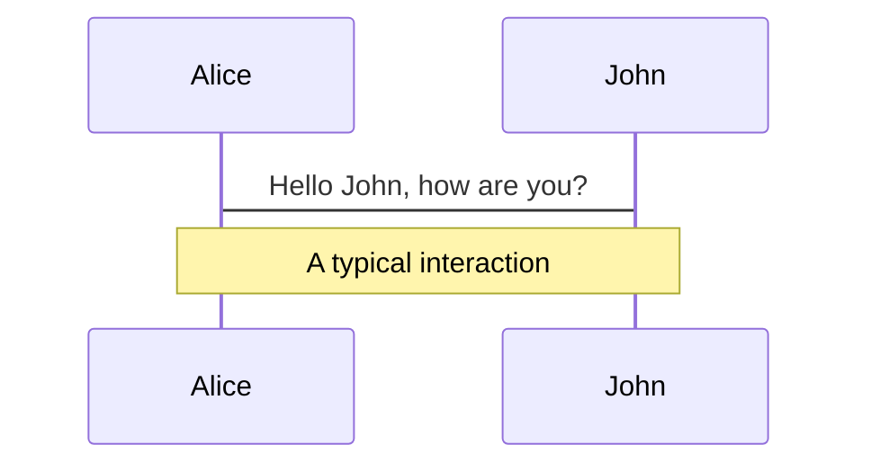
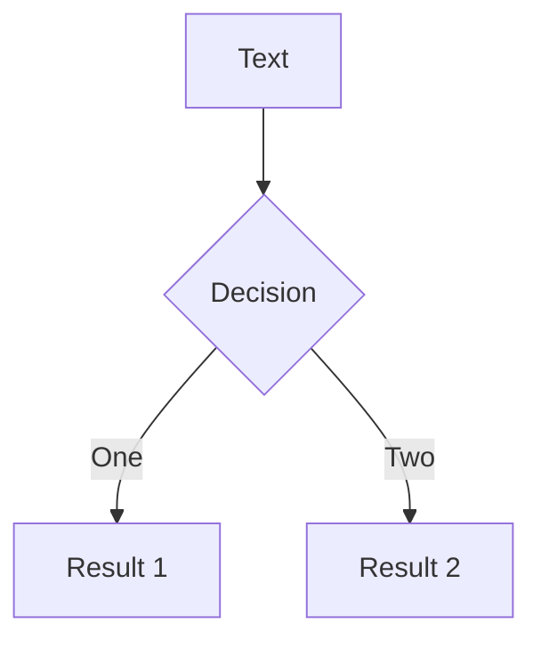
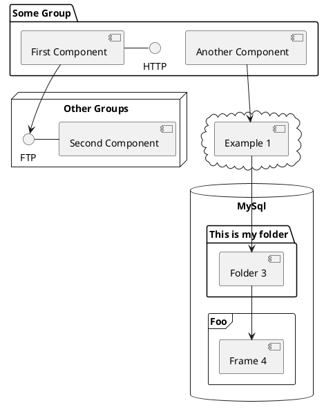

---
src: ./slides/intro-context.md
---

---
src: ./slides/intro-javascript-1.md
---

---
src: ./slides/intro-javascript-2.md
---

---
src: ./slides/intro-typescript.md
---

---
src: ./slides/classes-intro.md
---


---
layout: image-right
image: https://source.unsplash.com/collection/94734566/1920x1080
---

# Code

Use code snippets and get the highlighting directly![^1]

```ts {all|2|1-6|9|all}
interface User {
  id: number;
  firstName: string;
  lastName: string;
  role: string;
}

function updateUser(id: number, update: User) {
  const user = getUser(id);
  const newUser = { ...user, ...update };
  saveUser(id, newUser);
}
```

<arrow v-click="3" x1="400" y1="420" x2="230" y2="330" color="#564" width="3" arrowSize="1" />

[^1]: [Learn More](https://sli.dev/guide/syntax.html#line-highlighting)

<style>
.footnotes-sep {
  @apply mt-20 opacity-10;
}
.footnotes {
  @apply text-sm opacity-75;
}
.footnote-backref {
  display: none;
}
</style>

---

# Components

<div grid="~ cols-2 gap-4">
<div>

You can use Vue components directly inside your slides.

We have provided a few built-in components like `<Tweet/>` and `<Youtube/>` that you can use directly. And adding your custom components is also super easy.

```html
<Counter :count="10" />
```

<!-- ./components/Counter.vue -->
<Counter :count="10" m="t-4" />

Check out [the guides](https://sli.dev/builtin/components.html) for more.

</div>
<div>

```html
<Tweet id="1390115482657726468" />
```

<Tweet id="1390115482657726468" scale="0.65" />

</div>
</div>

---

## class: px-20

# Themes

Slidev comes with powerful theming support. Themes can provide styles, layouts, components, or even configurations for tools. Switching between themes by just **one edit** in your frontmatter:

<div grid="~ cols-2 gap-2" m="-t-2">

```yaml
---
theme: default
---
```

```yaml
---
theme: seriph
---
```


</div>

Read more about [How to use a theme](https://sli.dev/themes/use.html) and
check out the [Awesome Themes Gallery](https://sli.dev/themes/gallery.html).

---

## preload: false

# Animations

Animations are powered by [@vueuse/motion](https://motion.vueuse.org/).

```html
<div v-motion :initial="{ x: -80 }" :enter="{ x: 0 }">Slidev</div>
```

<div class="w-60 relative mt-6">
  <div class="relative w-40 h-40">
    
    
    
  </div>

  <div
    class="text-5xl absolute top-14 left-40 text-[#2B90B6] -z-1"
    v-motion
    :initial="{ x: -80, opacity: 0}"
    :enter="{ x: 0, opacity: 1, transition: { delay: 2000, duration: 1000 } }">
    Slidev
  </div>
</div>

<!-- vue script setup scripts can be directly used in markdown, and will only affects current page -->
<script setup lang="ts">
const final = {
  x: 0,
  y: 0,
  rotate: 0,
  scale: 1,
  transition: {
    type: 'spring',
    damping: 10,
    stiffness: 20,
    mass: 2
  }
}
</script>

<div
  v-motion
  :initial="{ x:35, y: 40, opacity: 0}"
  :enter="{ y: 0, opacity: 1, transition: { delay: 3500 } }">

[Learn More](https://sli.dev/guide/animations.html#motion)

</div>

---

# LaTeX

LaTeX is supported out-of-box powered by [KaTeX](https://katex.org/).

<br>

Inline $\sqrt{3x-1}+(1+x)^2$

Block

$$
\begin{array}{c}

\nabla \times \vec{\mathbf{B}} -\, \frac1c\, \frac{\partial\vec{\mathbf{E}}}{\partial t} &
= \frac{4\pi}{c}\vec{\mathbf{j}}    \nabla \cdot \vec{\mathbf{E}} & = 4 \pi \rho \\

\nabla \times \vec{\mathbf{E}}\, +\, \frac1c\, \frac{\partial\vec{\mathbf{B}}}{\partial t} & = \vec{\mathbf{0}} \\

\nabla \cdot \vec{\mathbf{B}} & = 0

\end{array}
$$

<br>

[Learn more](https://sli.dev/guide/syntax#latex)

---

# Diagrams

You can create diagrams / graphs from textual descriptions, directly in your Markdown.

<div class="grid grid-cols-3 gap-10 pt-4 -mb-6">







</div>

[Learn More](https://sli.dev/guide/syntax.html#diagrams)

---

layout: center
class: text-center

---

# Learn More

[Documentations](https://sli.dev) · [GitHub](https://github.com/slidevjs/slidev) · [Showcases](https://sli.dev/showcases.html)

---

layout: intro
image: "/bg-example.png"
floatingImage: "/floating.png"

---

<div class="h-full flex justify-between flex-col">
  <div>
    <div class="w-full max-w-[72%] mt-32">
      
      
      <h2 class="text-[#111827] font-extrabold dark:text-gray-400">
        <span class="text-primary dark:text-white">Image automation</span> for marketing and social networks
      </h2>
    </div>
  </div>

  <div>
    <a href="https://flayyer.com/" target="_blank" rel="noopener noreferrer">
      https://flayyer.com/
    </a>
  </div>
</div>

---

layout: text-image
image: "/image-example-1.png"
class: "py-24"

---

<h2 class="text-[#111827] font-extrabold dark:text-gray-400">
  <span class="text-primary dark:text-white">Problem 1:</span> Labor hours are wasted on repetitive design tasks
</h2>

<br />
<br />

- People are better at being creative and machines are better at repetition.
- **40% of workers feel they waste 1/4 of their week on repetitive tasks.**
- Visual consistency is important and it is costly to adapt to change if you have thousands of products and images.

---

layout: text-image
image: "/image-example-2.png"
imageFirst: true
contentCols: "col-span-7"
imageCols: "col-span-5"

---

<div class="py-20">
  <h2 class="text-[#111827] font-extrabold dark:text-gray-400">
    <span class="text-primary dark:text-white">Problem 2:</span> 70.9% of people are hesitant to open the links they receive
  </h2>

  <br />
  <br />

- Companies neglect how their links look when they are shared by people on social networks.
- **The most important factor that determines people's trust and interest in links is the image and the URL.**
- There is a sea of information and every day it is more difficult to capture people's attention.
</div>

---

layout: text-image
image: "/floating.png"
class: "py-16"
contentCols: "col-span-6"
imageCols: "col-span-6"

---

<h2 class="text-[#111827] font-extrabold dark:text-gray-400">
  <span class="text-primary dark:text-white">What we do:</span> Flayyer is an image automation service.
</h2>

<br />
<br />

We allow creatives to focus on creating and **not repeating.**

**We improve your brand perception** from the moment they are shared on social media and group chats.

**We add a layer of intelligence:** Know what links people are sharing and where.

**We increase the number of visits to your site.**

---

## layout: blank

<h2 class="text-[#111827] text-center font-extrabold dark:text-gray-400">
  <span class="text-primary dark:text-white">Use cases:</span> Responsive image generation for social networks
</h2>


---

layout: text-image
image: '/floating.png'
class: 'gap-8 py-24'
contentCols: "col-span-7"
imageCols: "col-span-5"

---

<h2 class="text-[#111827] font-extrabold mb-4 dark:text-gray-400">
  You can also use code
</h2>

```tsx
import { FlayyerIO } from "@flayyer/flayyer";

const flayyer = new FlayyerIO({
  tenant: "flayyer",
  deck: "demo",
  template: "main",
  variables: { title: "Create more engagement" }
});

<meta property="og:image" content="{flayyer.href()}" />
<meta name="twitter:image" content="{flayyer.href()}" />
```

---

## layout: cover

<h2 class="text-[#111827] text-center font-extrabold dark:text-gray-400">
  A blank slide to do whatever you want
</h2>
